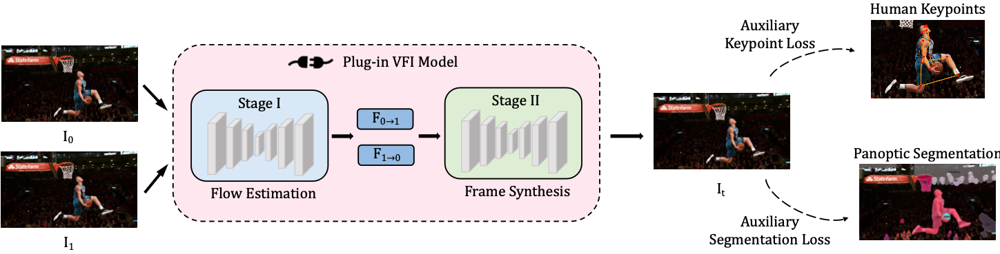

# SportsSloMo 	

[](https://arxiv.org/abs/2308.16876)
[](https://github.com/neu-vi/SportsSloMo)
[](https://www.youtube.com/watch?v=FNMqoETB1sU)

**This is the official repository of SportsSloMo**

\[[ArXiv Paper](https://arxiv.org/abs/2308.16876)\] \[[Demo(YouTube)](https://www.youtube.com/watch?v=FNMqoETB1sU)\] \[[Project Page](https://neu-vi.github.io/SportsSlomo/)\]

We provide the video clips along with the code and trained weights for SportsSloMo. If you find this repository useful, please consider citing our [paper](https://arxiv.org/abs/2308.16876).

### Examples of the sports scenes in SportsSloMo 
<center></center>
We propose a challenging dataset consisting of high-resolution (≥720p) sports videos with careful curation, tailored for human-centric scenarios. Our dataset covers 22 various sports categories with different content and motion patterns, including hockey, baseball, skating, basketball, running, volleyball, etc.

## Table of Contents
1. [SportsSloMo Dataset](#Dataset)
1. [Requirements](#Requirements)
1. [Video Frame Interpolation](#VideoFrameInterpolation)
1. [Human-aware Loss Terms](#HumanLoss)
1. [Acknowledgement](#Acknowledgement)
1. [Reference](#Reference)
1. [Contact](#Contact)

## Dataset
#### Dataset intro
Our dataset is targeted for human-centric scenarios covering various sports, and we provide over 8k long video clips that can be used for video frame interpolation, video super-resolution, group activity recognition and dynamic view synthesis.

Video sequences of SportsSloMo dataset can be downloaded at the [link](https://vil.khoury.northeastern.edu/files/sportsslomo_video_seqs.zip).

**Note** that the data that we provide in the link is video files, additional processing is needed to extract frames from these video clips, please consider follow the step in the **Preparation** part below.

Our dataset has following directory format:

```
├──── SportsSloMo_frames/
    ├──── clip_0000/
       ├──── frame_0000.png
             ├──── ...
    ├──── clip_0001/
       ├──── frame_0000.png
             ├──── ...
    ├──── ...
```

#### Preparation
```
mkdir SportsSloMo_video
cd SportsSloMo_video
## Download sportsslomo_video_seqs.zip to this directory
unzip sportsslomo_video_seqs.zip

## Extract frames for each clip
cd SportsSloMo_EBME
python scripts/extract_frames.py
```

## Requirements

In this repo, we provide the environment setting and sample code needed for plugging in auxiliary losses into the [EBME](https://github.com/srcn-ivl/EBME) model, and other VFI models are also compatibale unless specific packages need to be installed.

Our code is implemented using PyTorch 1.12.1 and Cuda 11.3, and we use CuPy package for forward warping operation (check [softmax-splatting](https://github.com/sniklaus/softmax-splatting) for details).

#### Installation

Create a conda environment and install dependencies:

```
git clone https://github.com/neu-vi/SportsSloMo.git
cd SportsSloMo_EBME

conda create --name SportsSloMo python=3.8
conda activate SportsSloMo

# Install the according versions of torch and torchvision
pip install torch==1.12.1+cu113 torchvision==0.13.1+cu113 torchaudio==0.12.1 --extra-index-url https://download.pytorch.org/whl/cu113

# Install required packages 
pip install -U opencv-python
pip install -r requirements.txt

# Install the according version of CuPy
pip install cupy_cuda113==10.6.0

## Install packages for Mask2Former
# Install detectron2, note that gcc & g++ ≥ 5.4 are required.
pip install ninja
git clone https://github.com/facebookresearch/detectron2.git
cd detectron2
pip install -e .
# Install Mask2Former
cd ..
git clone https://github.com/facebookresearch/Mask2Former.git
cd Mask2Former
cd mask2former/modeling/pixel_decoder/ops
sh make.sh

```

## VideoFrameInterpolation

We provide intructions and code for conducting Video Frame Interpolation on our SportsSloMo dataset using the baseline [EBME](https://github.com/srcn-ivl/EBME) as example.

```
cd SportsSloMo_EBME
mkdir splits
```

Then download our split files for training/testing from this [link](https://drive.google.com/file/d/1qRaJ0i6z0z8pP8fAKjGYljCg4KZMxp6m/view?usp=sharing) to splits/ folder.

### Train
```
bash train_SportsSloMo.sh
```
Adjust CUDA_VISIBLE_DEVICES and other distributed training parameters in this file according to your machine, and set the data_root to where you store the SportsSloMo video frames.

### Benchmark
TODO.

### Demo
TODO.


## HumanLoss

To improve the existing video frame interpolation models on our human-centric SportsSloMo benchmark, we introduce two loss terms considering the human-aware priors. We propose loss terms based on human segmentation in the panoptic setting and human keypoints estimation as extra supervision for intermediate frame synthesis.

### Pipeline overview
<center></center>
Both of our proposed human-aware loss terms are model agnostic and can be easily integrated into any video frame interpolation approach.

### Data preparation
We provide scripts and instructions to acquire ground-truth detected keypoints and segmentation masks for our human-aware loss terms.

**Note** that large storage space is needed to store the extracted keypoints and segmentation masks, so make sure that there is enough storage space in your machine:)

#### Visualization of human keypoints and segmentation masks
<center></center>

#### Keypoint data
```
# Install ViTPose_pytorch 
git clone https://github.com/jaehyunnn/ViTPose_pytorch.git
cd ViTPose_pytorch
mkdir checkpoints
# download model to this directory [link](https://1drv.ms/u/s!AimBgYV7JjTlgTBm3dCVmBUbHYT6?e=fHUrTq)

# Install Yolov8
pip install ultralytics

# Extract keypoints for auxiliary loss terms
python extract_keypoints.py
```

#### Segmentation data
```
# Download Mask2Former Checkpoint
cd Mask2Former
mkdir checkpoints
# download model to this directory [link](https://dl.fbaipublicfiles.com/maskformer/mask2former/coco/panoptic/maskformer2_swin_large_IN21k_384_bs16_100ep/model_final_f07440.pkl)

```

### Training
TODO.


## Acknowledgement
Our code is based on the implementation of [EBME](https://github.com/srcn-ivl/EBME), [XVFI](https://github.com/JihyongOh/XVFI/tree/main#Test), [RIFE](https://github.com/megvii-research/ECCV2022-RIFE) and [softmax-splatting](https://github.com/sniklaus/softmax-splatting). We also borrow code from [Mask2Former](https://github.com/facebookresearch/Mask2Former), [YOLOv8](https://github.com/ultralytics/ultralytics), [ViTPose_unofficial](https://github.com/jaehyunnn/ViTPose_pytorch) and [ViTPose](https://github.com/ViTAE-Transformer/ViTPose). We sincerely thanks those authors for their great works. If you use our codes, please also consider cite their nice works.

<!-- **Reference**:   -->
## Reference
> Jiaben Chen and Huaizu Jiang "SportsSloMo: A New Benchmark and Baselines for Human-centric Video Frame Interpolation"
> 
**BibTeX**
```bibtex
@article{chen2023sportsslomo,
  title={SportsSloMo: A New Benchmark and Baselines for Human-centric Video Frame Interpolation},
  author={Chen, Jiaben and Jiang, Huaizu},
  journal={arXiv preprint arXiv:2308.16876},
  year={2023}
}
```

## Contact
If you have any question, please send an email to [[Jiaben Chen](https://jiabenchen.github.io)] - jic088@ucsd.edu

## License
The source codes and datasets can be freely used for research and education only. Any commercial use should get formal permission first.
